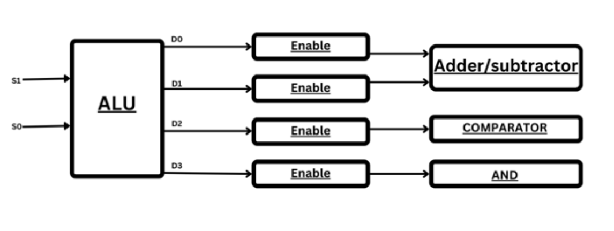

# 4-bit-ALU

This project involves the design of a 4-bit Arithmetic Logic Unit (ALU) capable of performing addition, subtraction, comparison, and ANDing operations. The project also includes estimating the critical path and maximum delay possible in the circuit. The layout of the ALU is designed, with each standard cell's location clearly indicated. A comparison of pre- and post-layout results is provided, along with functionality verification using Verilog.

This project was completed as part of the VLSI Design course during the Monsoon 2023 semester. The design is based on 180nm technology.

## Tools used:

* Verilog: For functionality verification.
* NG-SPICE: For circuit design and simulation.
* Magic: For layout design.

## Block Diagram 

## How to use:

### Verilog:
* Run the following command to compile the Verilog code:

        iverilog ALU.v ALU_tb.v

* Execute the compiled output:

        ./a.out

* The file Verilog_Outputs.txt contains all possible outputs.
* Open ALU_out.vcd to view the GTKWave plots.

### NGSPICE:
* Ensure proper supply voltages are placed in place of commented lines with `* Supply for ...`
* Replace `* Operation` with plot commands to plot the necessary nodes of the circuit.
* Use the following command to run the NG-SPICE simulation:

        ngspice ALU.cir

* To perform delay analysis for specific blocks (ADDER, SUBTRACTOR, AND, Comparator), run:

        python3 BLOCK_Delayanalysis.py
Replace BLOCK with the specific block name.
* To find the critical path, run:

        python3 CriticalPath.py
### MAGIC
* Open the circuit design in Magic Layout using the following command:

        magic -T SCN6M_DEEP.09.tech27 ALU.mag
* Follow the same steps as in the NGSPICE section to see the results.

## Project Details:

* Design Technology: 180nm
* Course: VLSI Design, Monsoon 2023

This README file provides a comprehensive guide to using the tools and verifying the functionality of the 4-bit ALU design. Follow the instructions in each section to perform simulations, delay analysis, and layout checks.